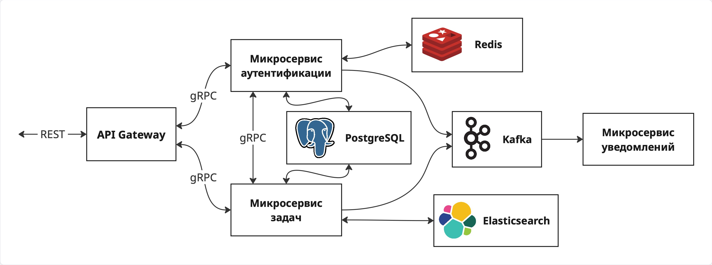

# tasks-grpc

## 📌 О проекте

**tasks-grpc** — это микросервисная система на Go, построенная на gRPC.

Проект демонстрирует архитектуру распределённого приложения, в котором каждый сервис отвечает за свой набор функций, а взаимодействие между ними происходит через высокопроизводительный gRPC API.

## ⚙️ Технологии
- **Go** — основной язык разработки  
- **gRPC + Protobuf** — высокопроизводительная коммуникация между сервисами  
- **Kafka** — брокер событий для передачи сообщений между сервисами (auth -> notifications, tasks -> notifications)  
- **Redis** — хранение временных данных  
- **PostgreSQL** — основная реляционная база данных  
- **Docker / Docker Compose** — контейнеризация и процесс развёртывания  

## 📂 Структура проекта


## ⚙️ Основные возможности
- Регистрация, вход аккаунт, смена почты, валидация кода с почты для ее подтверждения
- Создание, обновление, удаление и получение задач
- Асинхронные уведомления о действиях с задачами на почту через Kafka

## 📄 Документация API

После запуска проекта (через Docker или локально) Swagger UI доступен по адресу:

👉 **http://localhost:8080/docs**

## 🚀 Быстрый старт (локально через Docker)

1. ### Клонируйте репозиторий:
   ```bash
   git clone https://github.com/Novip1906/tasks-grpc.git
   cd tasks-grpc
2. ### Изменить конфиг
   - Создать .env и записать туда пароль от почты (SMTP_PASSWORD=...)
   - В /notifications/configs ввести остальные данные от почты
3. ### Запустите инфраструктуру и сервисы:
    ```bash
    docker-compose up --build


